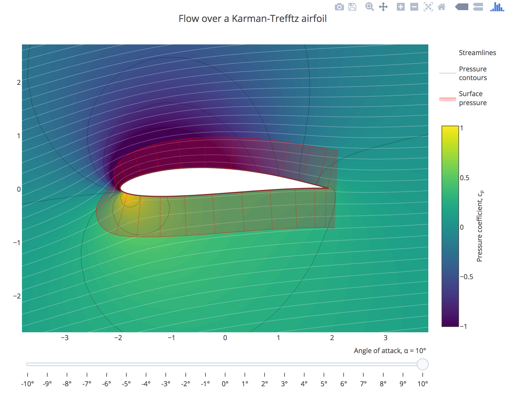

# plotly-airfoil-example

> [http://rickyreusser.com/plotly-airfoil-example/](http://rickyreusser.com/plotly-airfoil-example/)

**NB: This uses currently-unreleased plotly.js features**

## License

&copy; 2017 Ricky Reusser. WTFPL.
